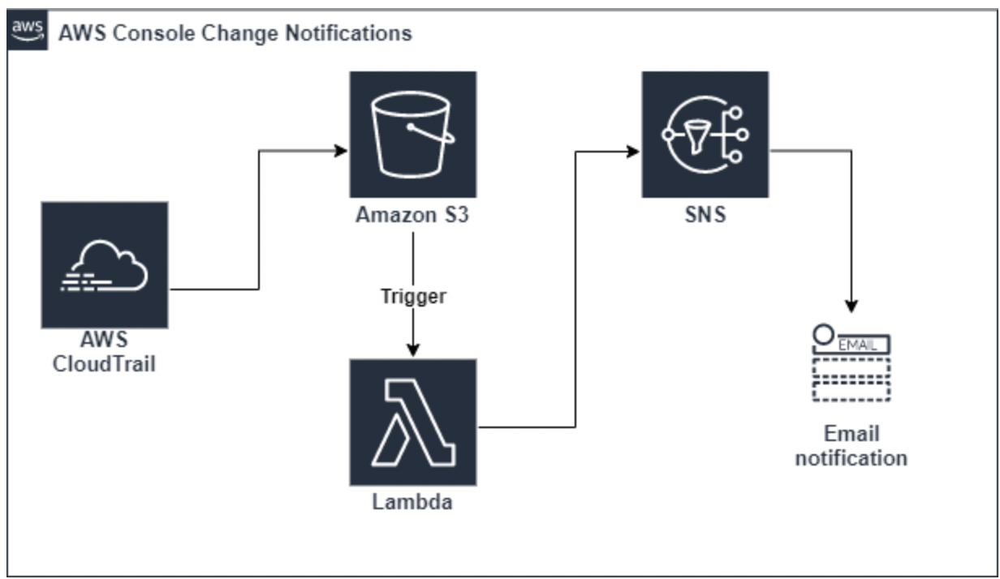

[Tips from my Journey to an AWS Solutions Architect Associate Certification](https://medium.com/@lior.k.sh/tips-from-my-journey-for-aws-solutions-architect-associate-certification-8f4eb8344a98)

I scheduled the exam for two months in advance and began the preparations 🎓. After achieving the certification recently (passed with 93% score), I’m sharing my personal insights about the process, which I hope you find useful and inspiring.

[#100daysofAWS](https://towardsaws.com/100daysofaws-day-1-ec2-346c40430fae)

[MariaDB Server Documentation](https://mariadb.com/kb/en/documentation/)

[What's New with AWS?](https://aws.amazon.com/new)

[AWS News Blog](https://aws.amazon.com/blogs/aws/)

[Running a HTTPS Python Server on EC2 in 5 Minutes](https://pancy.medium.com/running-a-https-python-server-on-ec2-in-5-minutes-6c1f0444a0cf)

Here I’m going to walk you through setting up a running HTTPS API server in Python using FastAPI (trust me, Flask is so 2008) and Caddy web server (this one is a total replacement to NGINX and gives you automatic HTTPS, saving you from the pain of setting up TLS certificate).
🤷 Tips: Hold it if you are tempted to Dockerize your app for your first Product Hunt launch or Hacker News show and tell. You’re distracted.

[Roman Numerals Converter Application (Python Flask) deployed on AWS EC2 with CloudFormation](https://faun.pub/roman-numerals-converter-application-python-flask-deployed-on-aws-ec2-with-cloudformation-e473e5aeb054)

The Roman Numerals Converter Application aims to convert the given number to Roman numerals. The application is to be coded in Python and deployed as a web application with Flask on AWS Elastic Compute Cloud (EC2) Instance using AWS CloudFormation Service.

[AWS Solution Architect Professional — Exam tips -2021](https://medium.com/startcloudnow/aws-solution-architect-professional-exam-tips-2021-9dee760f20ec)

I recently had to recertify my AWS Solution Architect Professional exam. AWS is very nice in that they give you three years to recertify. Even though it’s three years preparing for recertification can be stressful. If you choose not to recertify I can understand but if you plan on keeping it well let just say on AWS a lot of things change fast.

My preparation for this exam was very very stressful mainly because I had done a series of exams in December 2020 and this was my first for 2021 so my brain needed a rest. This exam is the real deal it covers the full gambit. From my experience, this is the rabbit hole I had to face. It covered topics like, storage, analytics, networking, compute, database types, migration, security both services and policy, serverless, Amazon FSx, API stuff, Appsec, Organisations, IAM, and more. See — Exam blueprint

[AWS Solutions Architect: Exam Question Deep Dive](https://codeburst.io/aws-solutions-architect-exam-question-deep-dive-d9ea49479a11)

As I have prepared for AWS exams, I found dissecting exam questions helpful to grow my AWS knowledge. This post is a bite-sized study guide that will hopefully expand your knowledge of AWS and help you on your journey to becoming a Solutions Architect as well.

For each post in this series, I am choosing one AWS Solutions Architect Professional exam question. We will explore the required knowledge and strategy to find the right answer and learn about a few AWS services along the way.

[AWS Application Load Balancer algorithms](https://medium.com/dazn-tech/aws-application-load-balancer-algorithms-765be2eca158)

All load balancers support some balancing algorithms. These algorithms define which target handles each request. They’re often ignored, but choosing the correct balancing algorithm can have a big impact on your application performance. The most common algorithms are round-robin and least connections, known as Least Outstanding Requests by AWS. Let’s take a look at how each of these work.

[CloudWatch vs CloudTrail](https://digitalcloud.training/cloudwatch-vs-cloudtrail-comparison/)

`Two of the most important “Cloud” services to know for your exam are Amazon CloudWatch and AWS CloudTrail`. You may have already heard of these services before because they’re quite popular on AWS (for a good reason). They’re popular because they both perform a very important function. With “Watch” and “Trail” at the end of the name, can you guess what essential function it is that they perform?

You got it, monitoring!

[A Cloud Migration Questionnaire for Solution Architects](https://betterprogramming.pub/a-cloud-migration-questionnaire-for-solution-architects-dec7ffcf063e#28dc)

Many companies operating from their own data centers started migrating their applications to the cloud, and it has become an obvious choice for many startups to create cloud-native applications. This is most important because of the speed of time to market and cost-efficiency in addition to many other benefits of the cloud.

As a solution architect, you need to ask relevant questions to gather the required information from customers. The solution you build based on this information from the customer lays the foundation for future design solutions and migrations.

[AWS Solution Architect Associate Exam Study Notes
](https://chloemcateer.medium.com/aws-solution-architect-associate-exam-study-notes-b6c5884ee500)

While studying for my exam I created a tonne of notes to break down and understand all of the different services.
Before sitting the exam, I took my notes and created high level summaries for each service and I have decided to share each of these summaries through blogs!

One thing to note is that these are just overall summaries, so I would not recommend solely using these for your studies, but to use as an overview or as some reading to do the week of your exam.

[AWS — Elastic Load Balancer (ELB) Overview](https://medium.com/awesome-cloud/aws-elastic-load-balancer-elb-overview-introduction-to-aws-elb-alb-nlb-gwlb-e2820fe8fe27)

AWS Elastic Load Balancer (ELB) automatically distributes your incoming traffic across multiple targets, such as EC2 instances, containers, and IP addresses, in one or more Availability Zones. It monitors the health of its registered targets, and routes traffic only to the healthy targets. Elastic Load Balancing scales your load balancer as your incoming traffic changes over time. It can automatically scale to the vast majority of workloads.

[Preparing For AWS Interview Questions](https://neal-davis.medium.com/preparing-for-aws-interview-questions-ac493da5f60a)

Preparing well for an AWS interview is a great way to gain confidence and gain an edge over your competition. AWS interview questions can be tricky and cover more than just the technical aspects of the AWS Cloud. You need to ensure you have practiced your responses in advance. In this article, we will look at what to expect in an AWS interview and how to go about the preparation.

[How to run commands remotely on an EC2 instance using AWS Systems Manager](https://medium.com/workfall/how-to-run-commands-remotely-on-an-ec2-instance-using-aws-systems-manager-351284decbd4)

In this blog, we have explored that AWS Systems Manager has the ability to automate tasks and helps in keeping all our EC2 instances healthy, applications managed, secure and updated. We have also seen how we can make use of Amazon Systems Manager to execute a bunch of commands remotely on EC2 instances eliminating the need of SSH or bastion hosts. We will discuss more of Amazon Systems Manager and its other configurations in our upcoming blog. Stay tuned to keep getting all updates about our upcoming new blogs on AWS and relevant technologies.

[AWS Solution Architect Associate Exam Study Notes](https://chloemcateer.medium.com/aws-solution-architect-associate-exam-study-notes-b6c5884ee500)

While studying for my exam I created a tonne of notes to break down and understand all of the different services.

Before sitting the exam, I took my notes and created high level summaries for each service and I have decided to share each of these summaries through blogs!

One thing to note is that these are just overall summaries, so I would not recommend solely using these for your studies, but to use as an overview or as some reading to do the week of your exam.

[5 AWS Services You Should Avoid!](https://medium.com/teamzerolabs/5-aws-services-you-should-avoid-f45111cc10cd)

Get ready for some personal and definitely opinionated opinions!
AWS comes with many components that cover different areas of concerns. But, most are not general purpose and cheap enough to be applied correctly. Used in the wrong context, they end up wasting time, resources, money, and will create developer friction and frustrations for months.

Here are the top 5 AWS Services you should avoid:
- Cognito
- CloudFormation
- ElasticCache
- Kinesis
- Lambda

[How to pass AWS Solutions Architect Professional Exam?](https://medium.com/@talhaocakci/how-to-pass-aws-solutions-architect-professional-exam-87bebfdae86f)

First things first: Passing the exam does not mean you are a solutions architect. Second, the real target is to be a solutions architect, not a plain certificate holder. So, a certificate may be required but not sufficient for real job.

If we agree on it, we may talk about the details of both exam and AWS environment and how AWS certification exam evaluates you. By the way, I have prepared for the associate exam with this course. I highly recommend it.

[AWS Whitepapers & Guides](https://aws.amazon.com/whitepapers/?whitepapers-main.sort-by=item.additionalFields.sortDate&whitepapers-main.sort-order=desc&awsf.whitepapers-content-type=*all&awsf.whitepapers-tech-category=*all&awsf.whitepapers-industries=*all&awsf.whitepapers-business-category=*all&awsf.whitepapers-global-methodology=*all)

Expand your knowledge of the cloud with AWS technical content authored by AWS and the AWS community, including technical whitepapers, technical guides, reference material, and reference architecture diagrams.

[8 Interesting AWS Services](https://medium.com/devops-dudes/8-interesting-aws-services-3f802e2a7db8)

I’ve used a lot of AWS services lately, and I’ve come across multiple interesting services in AWS.
Most of them are related to cost management&saving, and security.

[AWS CloudFormation: Create a VPC with EC2 Instance](https://aws.plainenglish.io/aws-cloudformation-create-a-vpc-with-ec2-instance-34e27d59a842)

AWS CloudFormation, an Infrastructure as Code service, includes a template made up of nine sections. Although made up of nine sections, the Resources section is the only one required. For this project we will be using Mappings, Resources, and Outputs. I’ve broken my template down to explain what is going on in each section, but if you want to jump straight to the full CloudFormation Template feel free to skip to the end.

[S3 vs EBS vs EFS — Comparing AWS Storage Services](https://neal-davis.medium.com/s3-vs-ebs-vs-efs-comparing-aws-storage-services-76080002cb49)

AWS offers many services, so many that it can often get pretty confusing for beginners and experts alike. This is especially true when it comes to the many storage options AWS provides its users. Knowing the benefits and use cases of AWS storage services will help you design the best solution. In this article, we’ll be looking at S3 vs EBS vs EFS.

[Managing Temporary AWS Console Access](https://towardsaws.com/managing-temporary-aws-console-access-169b1f331e79)

Recently we had a scenario where we need to allow developers access to the parameter store so that they can check and update the parameters. Since developers may not be that comfortable working with AWS CLI, we decided to generate temporary IAM users with console access. In this post, we’ll see how we can create these temporary users and then delete them after some time.

[Journey into the Cloud: How to Become a AWS Certified Solution Architect](https://towardsdatascience.com/journey-into-the-clouds-how-to-become-a-aws-certified-solution-architect-719cae167e70)

I have been interested in expanding my knowledge as an IT solution architect from applications to infrastructure, so I decided to prepare for the Amazon Web Services Certified Solution Architect Associate exam which is one of the most important and widely recognized certificates in the IT industry*. I wanted to share my methodology for successfully preparing for the exam and thereby assist others on this journey.

[Find the hands-on tutorials for your AWS needs](https://aws.amazon.com/getting-started/hands-on/?getting-started-all.sort-by=item.additionalFields.sortOrder&getting-started-all.sort-order=asc&awsf.getting-started-category=*all&awsf.getting-started-level=*all&awsf.getting-started-content-type=*all)

Find the hands-on tutorials for your AWS needs Get started with step-by-step tutorials to launch your first application

[How I passed two AWS certifications in less than two months.](https://ravindraelicherla.medium.com/how-i-passed-two-aws-certifications-in-two-months-511c484d0d0c)

AWS certification has been in my to-do list since 2017. Finally, Covid-19 lockdown gave an opportunity to work from home and I realized I am saving lot of driving time. I could also plan my morning time bit more effectively. In May 2020, I decided I should look at completing few certifications after we had successfully gone live with a brand new project in office.

[AWS — Site-to-Site VPN Connections Overview](https://medium.com/awesome-cloud/aws-site-to-site-vpn-connections-overview-introduction-to-aws-vpn-getting-started-ba889c2f1849)

AWS VPN solutions establish secure connections between your on-premises networks, remote offices, client devices, and the AWS global network. You can extend your on-premises networks to the cloud and securely access them from anywhere.

[Disaster Recovery vs. Backups — What’s the Difference?](https://aws.plainenglish.io/what-we-misunderstand-about-disaster-recovery-and-backups-32d89e3cae77)

The key for you to take away is that these two have entirely different use cases, two different goals. So, solving your disaster problem cannot be done with backups, and disaster recovery is not a backup of your production system. You can’t just have a disaster recovery site and assume that that is good enough. Your disaster recovery site should be taking backups of the data that lives within it, so in the event of a huge disaster where your streaming is interrupted or corrupted, you have a proper backup. I mean, host failures can also happen in a disaster recovery site just like they can happen in a production site.

[Top 7 Serverless AWS Services](https://aws.plainenglish.io/top-7-serverless-aws-services-db8fab3d5901)

What is Serverless?
Serverless is a development model that allows us to build and run applications…

The biggest advantage of this approach is that you pay only for the compute power, storage, and other resources you use without any up-front commitments. Also, your application can scale up based on demand. You have access to compute and storage resources when you need them.

Although there are a lot of services available, there are only 7 core services to build a serverless application:
- API Gateway — API, REST API
- Lambda — Logic, Execute code
- DynamoDB — Data, Store & - - Retrieve Data
- Cognito — Auth, Authenticate Users
- S3 — App, Serve static app
- CloudFront — Cache, Improve Performance with Caching
- Route 53 — DNS, Translate URL

[How I Passed the AWS Certified Solutions Architect (SAA-C02) With Zero Experience Within Two Months](https://towardsdatascience.com/how-i-passed-the-aws-certified-solutions-architect-saa-c02-with-zero-experience-within-two-months-ecc3fa5c1d28)

Before starting preparation for this exam, I had zero experience with AWS. But after two months, I’m certified! Do I say that this is an easy exam? NO! Absolutely wrong. The scope of this exam is extremely large and nearly most of the AWS services involved. In this article, I will share how I studied and passed the AWS Certified Solutions Architect (SAA-C02).

[AWS Cost Optimization Checklist](https://thechief.io/c/hrishikesh/aws-cost-optimization-checklist/)

Are you sure you’re following all of the practices and strategies to optimize your expenses? AWS has many flexible methods of keeping your expenditure to a minimum but the myriad of services and strategies could overwhelm you. Check out the list of essential strategies below to see if you’ve got all your bases covered.

[Use These Tools to Optimize your AWS Costs](https://faun.pub/use-these-tools-to-optimize-your-aws-costs-38e6bb2404cf)

Cloud services, AWS especially comes with a bunch of resources and features that can both enhance your experience and on the other hand, be a little bit pricey. Use the following tools to observe, analyze, and optimize the costs of your AWS cloud infrastructure.

[Using Amazon Servers — EC2 vs LightSail](https://neal-davis.medium.com/using-amazon-servers-ec2-vs-lightsail-7abc0a6d9a47)

Which type of Amazon Server should you use for your next project? This is a question that often comes up. Amazon Web Services (AWS) provides several options for running compute services. You can run virtual servers in an Infrastructure as a Service (IaaS) model on Amazon EC2 and Amazon LightSail. You can run serverless compute functions on AWS Lambda and you can run Docker containers on Amazon ECS.

[What Is the Difference Between EBS, EFS, and Instance Store?](https://medium.com/programmingnotes/aws-storage-ebs-efs-and-instance-store-d5e958eab838)

The EBS provides persistent block storage volumes for use with Amazon EC2 instances. EFS is used for network storage and the instance store provides temporary block-level storage for your instance. Let's explore each of these in detail over this article.

[Amazon SQS (Simple Queue Service): Quick Overview and Tutorial](https://blog.iron.io/amazon-sqs-simple-queue-service-overview-and-tutorial/)

Queues are a powerful way of combining software architectures. They allow for asynchronous communication between different systems, and are especially useful when the throughput of the systems is unequal.   Amazon offers their version of queues with Amazon SQS (Simple Queue Service).

For example, if you have something like:

- System A - produces messages periodically in huge bursts
- System B - consumes messages constantly, at a slower pace

[The Absolute minimum every developer must know about AWS Security!](https://faun.pub/the-absolute-minimum-every-developer-must-know-about-aws-security-7b448a10570a)

The cloud is becoming increasingly popular in our day and age. It is the driving force of the modern world, and engineers are starting to shift their careers accordingly. Whatever your profession, chances are that you will have to work with the cloud in some way or another. Terms such as VPCs, subnets, security groups, ECS, and so on will no longer sound unfamiliar. But have we really grasped the gravity of this seismic shift?

[15 AWSome years of Amazon EC2 and still going strong!](https://medium.com/workfall/15-awsome-years-of-amazon-ec2-and-still-going-strong-fcc7916955ca)

This year marks the 15th anniversary of Amazon EC2(Amazon Elastic Compute Cloud), marking a landmark milestone for both the firm and the computing industry it serves. The EC2 instance is at the heart of the AWS cloud platform, allowing users to rent storage, network connectivity, and computation resources.

[AWS Basics: Security Groups vs NACL](https://aws.plainenglish.io/aws-basics-security-groups-vs-nacl-826de14c2bc1)

The AWS VPC network layer can be protected with Security Group and with NACL (Network ACL). These constructs provide a “similar” functionality. Hence it becomes the confusing to understand which one should to use.
First point to understand is that these are complementing constructs. Which means you should use both of them. Together these form a “Swiss cheese model”.

[Protect your Infrastructure with Real-time Notifications of AWS Console User Changes](https://towardsdatascience.com/protect-your-infrastructure-with-real-time-notifications-of-aws-console-user-changes-3144fd18c680)

You’ve embraced infrastructure as code (IoC) and painstakingly created Terraform or CloudFormation to model your EC2 Instances, AutoScaling Groups, ECS clusters, and everything else. The devops and development teams have committed to only modify and create infrastructure using your chosen IoC tools — but, surprise, some people just won’t comply. Maybe someone gets lazy during feature development or takes a shortcut during incident response. Maybe you’ve outsourced your level one support and you don’t entirely trust that group yet. Whatever the reason, you would love to know when a user logs in to the AWS Console web site and manually changes things.

[AWS — WAF (Web Application Firewall) Overview](https://medium.com/awesome-cloud/aws-waf-web-application-firewall-overview-what-is-aws-waf-introduction-to-aws-web-application-firewall-6247a8a0283d)

AWS WAF is a managed web application firewall service that helps you protect your web applications at the application layer from common web exploits that could affect application availability, compromise security, and/or consume excessive resources.

