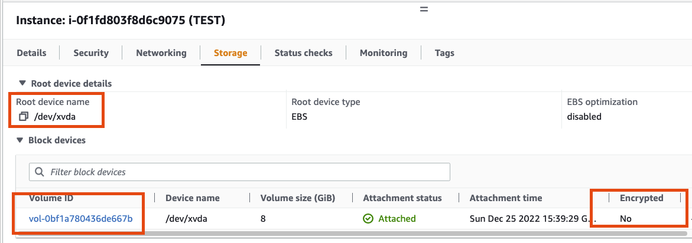
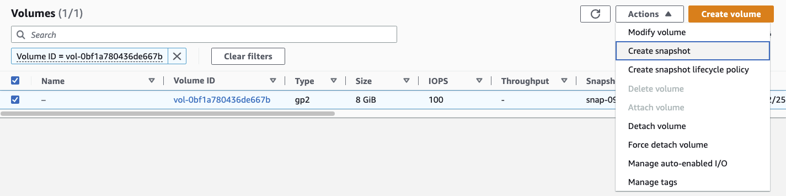
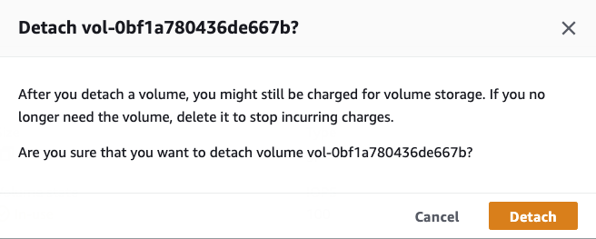

[How to encrypt EBS volumes of a running EC2 instance?](https://medium.com/@IshwarChandra/how-to-encrypt-ebs-volumes-of-a-running-ec2-instance-a2236b0b45)

[[Security As Code] Leverage AWS Lambda Function to Identify Unencrypted EC2 EBS Volumes](https://aws.plainenglish.io/security-as-code-leverage-aws-lambda-function-to-identify-unencrypted-ec2-ebs-volumes-e8337fc073e6)

[AWS: EKS — Encrypt current PV (EBS Volume)](https://medium.com/@artem.hatchenko/aws-eks-encrypt-current-pv-ebs-volume-69e712573c18)

[Deploy an EC2 Instance with a KMS Encryption Key](https://medium.com/cloud-security/deploy-an-ec2-instance-with-a-kms-encryption-key-6885959036d0)

[How to encrypt EBS Volume using KMS](https://medium.com/@devopslearning/100-days-of-devops-day-23-how-to-encrypt-ebs-volume-using-kms-3706f7990f3)

[Encrypt an existing Kubernetes Persistent Volume running on AWS EKS](https://vimalpaliwal.medium.com/encrypt-an-existing-kubernetes-persistent-volume-running-on-aws-eks-f044268d1017)

[How to encrypt an existing (unencrypted) EC2 EBS volume
](https://levelup.gitconnected.com/how-to-encrypt-an-existing-unencrypted-ec2-ebs-volume-a2f0f5fca735)

[Results for Encrypt Volumes-Medium](https://medium.com/search?q=Encrypt+Volumes)


## How to Encrypt root AWS EBS Root Volume







```
CHECK AVAILABILITY ZONE OF EC2 when you create volume from the snapshot of unencrypted volume. It has to be in same AZs of EC2
```


```
GO TO EC2 INSTANCE AND SELECT THE STORAGE (VOLUME) OF INSTANCE AND THERE DETACH THE VOLUME.
```



