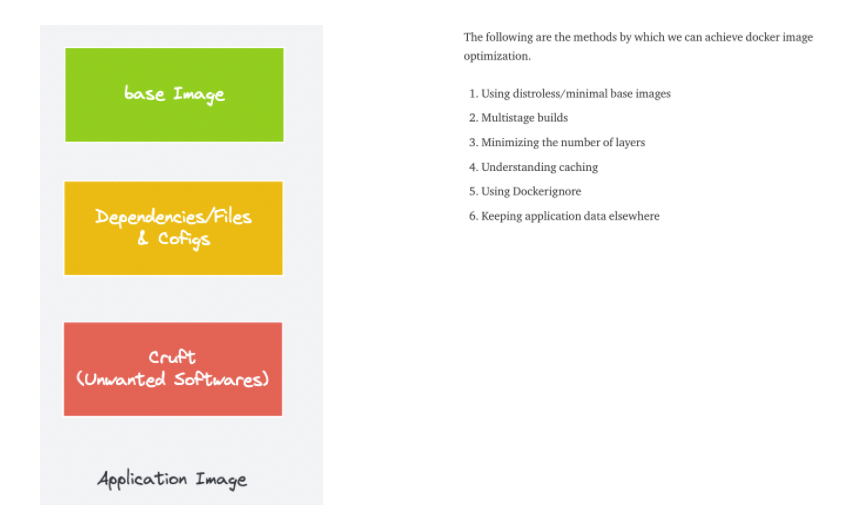
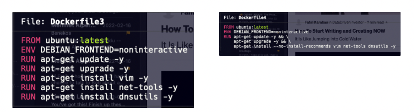
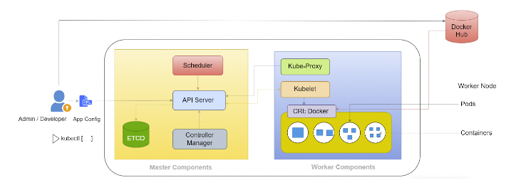
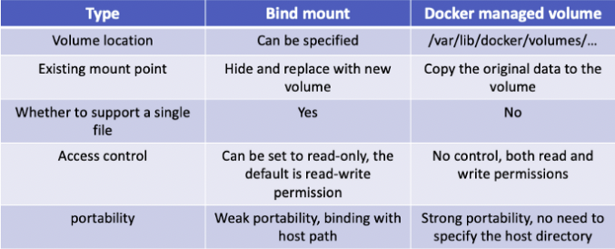
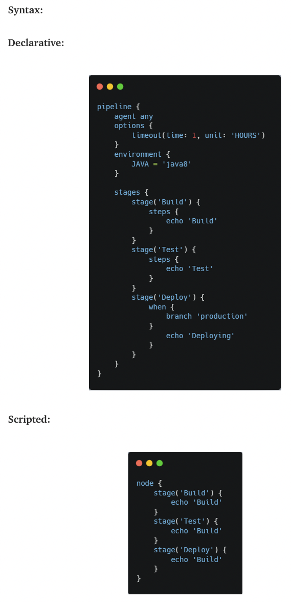
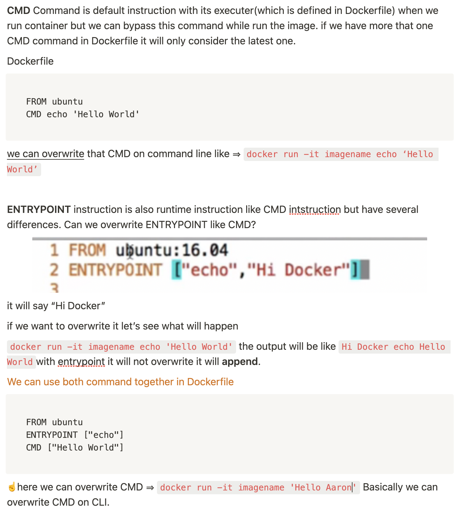
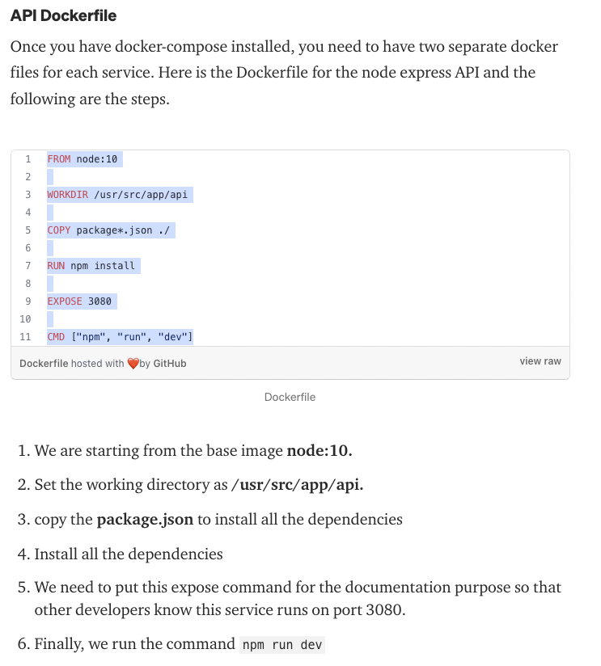
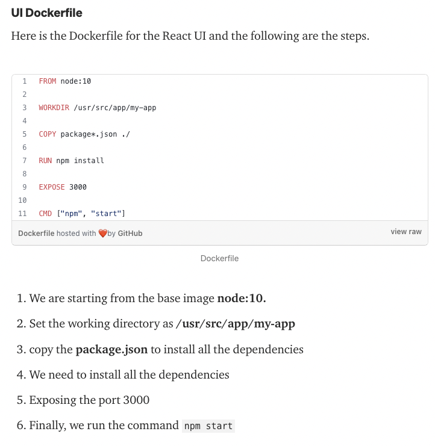
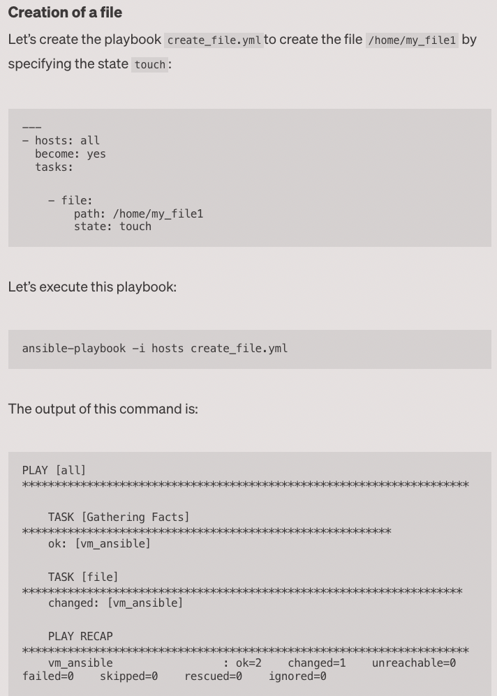

## [What is a Kubernetes Ephemeral Container?](https://devopslearners.com/what-is-a-kubernetes-ephemeral-container-aa8ab658755d)

When it comes to container security, distroless or minimal base images reduce the attack surface. But the common concern in using a distroless or minimal image is that,
How do I take an exec session to troubleshoot if something goes wrong in the application? `Because these images won’t even have a shell or any utilities required for troubleshooting`.

An ephemeral container is a concept of adding a container in an exiting pod for debugging purposes.

Let’s say you have a pod running on a minimal base image with just the application binaries and dependencies. Something went wrong, and you need to debug.

Since it is a stripped-down minimal base image without a shell, you cannot perform a “kubectl exec” command.

The following command will add the debug-image container to the running frontend pod and take an exec session for debugging.
```
kubectl debug -it pods/frontend — image=debug-image
```

## [Kubernetes Workflow for Absolute Beginners](https://technos.medium.com/kubernetes-workflow-bad346c54962)

Whenever we are executing any command let’s say “kubectl create pod nginx”, how the pod request work in the backend and how a pod is got created:

1. The request is authenticated first and validated.

2. The “kube-api-server” creates a POD object, without assigning it to a node, updates the information of the newly created pod in “ETCD Cluster” and updated/shows us a message that a POD is got created.

3. The “kube-scheduler” which is continually monitoring the “kube-api-server” gets to know that a new pod is got created with no node assigned to it.

4. The “kube-scheduler” identifies the right node (according to pod resource requirement, pod/node affinity rules, labels & selectors etc.) to place the new POD and communicate back to the “kube-api-server” (with the information of the right node for the pod)

5. The “kube-api-server” again updates the information to the “ETCD Cluster” received from “kube-scheduler”.

6. The “kube-api-server” then passed the same information to the “kubelet” on the appropriate worker node identified by “kube-scheduler” in the 4th step.

7. The “kubelet” then creates the pod on node and instructs the “Container Runtime Engine” to deploy the application image/container.

8. Once done, the “kubelet” updates the information/status of the pod back to the “kube-api-server”.

9. And “kube-api-server” updates the information/data back in the “ETCD Cluster”.

## [How To Reduce Docker Image Size: 6 Optimization Methods](https://devopslearners.com/how-to-reduce-docker-image-size-6-optimization-methods-cbbdab1196a7)

##

- it is best to have small-sized images to **reduce the image transfer and deploy time.**




****Method 1: Use Minimal Base Images****

- Your first focus should be on choosing the right base image with a minimal OS footprint.

Also, most of the distributions now have their minimal base images.

> Note: You cannot directly use the publicly available base images in project environments. You need to get approval from the enterprise security team to use the base image. In some organizations, the security team itself publishes base images every month after testing & security scanning. Those images would be available in the common organization docker private repository.
>
- You can further reduce the base image size using [distroless images](https://github.com/GoogleContainerTools/distroless). It is a stripped-down version of the operating system. Distroless base images are available for java, nodejs, python, Rust, etc.

****Method 2: Use Docker Multistage Builds****

- In multistage build, we get similar advantages as the builder pattern. We use **intermediate images**
 (build stages) to compile code, install dependencies, and package files in this approach. The idea behind this is to **eliminate unwanted layers**
 in the image.

```markdown
FROM node:16 as build

WORKDIR /app
COPY package.json index.js env ./
RUN npm install

FROM gcr.io/distroless/nodejs

COPY --from=build /app /
EXPOSE 3000
CMD ["index.js"]
```

***Method 3: Minimize the Number of Layers***

Docker images work in the following way — each `RUN, COPY, FROM` Dockerfile instructions add a new layer & each layer adds to the build execution time & increases the storage requirements of the image.



The Docker daemon has an in-built capability to display the total execution time that a Dockerfile is taking. To enable this feature, take the following steps -  `export DOCKER_BUILDKIT=1`

`time docker build -t fatihtepe/optimize:3.0 --no-cache -f Dockerfile4 .`

### **Method 4: Understanding Caching**

Often, the same image has to be rebuilt again & again with slight modifications in code.

Docker helps in such cases by storing the cache of each layer of a build, hoping that it might be useful in the future.

Due to this concept, it’s recommended to add the lines which are used for installing dependencies & packages earlier inside the Dockerfile — **before the COPY commands.**

The reason behind this is that docker would be able to cache the image with the required dependencies, and this cache can then be used in the following builds when code gets modified.

For example, let’s take a look at the following two Dockerfiles.

Dockerfile5

```
FROM ubuntu:latest
ENV DEBIAN_FRONTEND=noninteractive
RUN apt-get update -y
COPY .
```

Dockerfile6

```
FROM ubuntu:latest
COPY . .
ENV DEBIAN_FRONTEND=noninteractive
RUN apt-get update -y

```

Docker would be able to **use the cache functionality better** with Dockerfile6 than Dockerfile5 due to the better placement of the COPY command.

### **Method 5: Use Dockerignore**

As a rule, only the necessary files need to be copied over the docker image.

Docker can ignore the files present in the working directory if configured in the `.dockerignore` file.

This feature should be kept in mind while optimizing the docker image.

### **Method 6: Keep Application Data Elsewhere**

Storing application data in the image will unnecessarily increase the size of the images.

It’s highly recommended to use the volume feature of the container runtimes to keep the image separate from the data.

Docker containers support the implementation of CI/CD in development. Image size and build efficiency are important factors when overseeing and working with the [microservice architecture](https://phoenixnap.com/kb/introduction-to-microservices-architecture). This is why you should try to keep your Docker images small, by following the valuable advice outlined in this article.

## [Kubernetes — Objects (Resources) Overview](https://medium.com/devops-mojo/kubernetes-objects-resources-overview-introduction-understanding-kubernetes-objects-24d7b47bb018)
## [Kubernetes Architecture -In-Depth](https://bikramat.medium.com/kubernetes-architecture-in-depth-b5b909b10d77)


Kubernetes Control Plane Components
* `Kube API server`: Kubernetes API server is the central management entity that receives all requests for modifications of pods, services, replication controller, deployments, etc. `This is the only component that communicates with the etcd cluster.`

- `ETCD`: ETCD is a simple, distributed key-value storage that is used to store the Kubernetes cluster data (such as a number of pods, their state, namespace, etc).

- `Kube Controller Manager`: Controllers take care of actually running the cluster, and the Kubernetes controller-manager contains several controller functions in one. `Replication controller, Node Controller, Endpoints controller, ervice Account and Token controllers`

- `Kube Scheduler`: The scheduler is responsible to schedule pods in different nodes based on resource utilization. It reads the service’s operational requirements and schedules it on the best fit node. `For example, if the application needs 1GB of memory and 2 CPU cores, then the pods for that application will be scheduled on a node with at least those resources.`

Kubernetes Worker Components

- `Kubelet`: It is a Kubernetes agent that runs on each node in the cluster that communicates with the control plane.The kubelet takes a set of PodSpecs that are provided by the API server and ensures that the containers described in those PodSpecs are running and healthy. This component also reports about the state and health of the containers.

- `Kube Proxy`: Kube-proxy is a network proxy that runs on each node in your cluster. It also maintains network rules, allows network communication between services and pods, and is responsible for routing network traffic.

- `Container Runtime Interface`: A container runtime, also known as a container engine, is a software component that is responsible for running containers. The kubelet communicates with the container engine through the standard Container Runtime Interface and pulls the docker image from the docker hub.

How does Kubernetes work?



- A user writes a YAML file for pod specification and submits it to the API server, the API server will check for the authentication of that user, whether the user is authorized to perform the requested actions or not.

- Once the user validation is passed, the API server will store all the data related to pods and their specifications in the ETCD cluster.

- The schedule continuously watches the new request from the API server and once it gets the request from the API server, the scheduler finds the appropriate healthy worker nodes that match the requirement.

- The kubelet further communicates with the container engine through the standard Container Runtime Interface and pulls the docker image from the Docker hub and deploys the pods.

- Controllers watch and monitor the deployed pods and in case of any failure, it reports to the API server.


[Bind Mount vs Docker Managed Volume](https://blog.devgenius.io/docker-data-volume-af83671e25af)


In specific use, docker provides two types of volumes: `bind mount` and `docker managed volume`.
- bind mount

bind mount is to mount an existing directory or file on the host to the container.
```
docker run -d -p 80:80 -v ~/htdocs:/usr/local/apache2/htdocts:ro httpd
```
/usr/local/apache2/htdocs is where the httpd server stores static files. since this director already exists in the container, the original data will be hidden and replaced by data in ~/htdocs , which is persistent since it is located on the host.

- docker managed volume

`The biggest difference between docker-managed volume and bind mount is that there is no need to specify the mount source, just specify the mount point. Or take the httpd container as an example:
`
```
docker run -d -p 80:80 -v /usr/local/apache2/htdocs httpd
```
We do this by telling docker that we need a data volume and mount it to /usr/local/apache2/htdocs. So where exactly is this data volume?

This answer can be found in the container’s configuration information, execute the command: docker inspect .

```
docker inspect dafbfa86b404
......
"Mounts": [
{
  "Name": "fe43eaa90cfc3773ef535ec9e0a094d0ab0477ceb74ddebd57d3620ab50e85b1",
  "Source": "/var/lib/docker/volumes/fe43eaa90cfc3773ef535ec9e0a094d0ab0477ceb74ddebd57d3620ab50e85b1/_data",
  "Destination": "/usr/local/apache2/htdocs",
  "Driver": "local",
  "Mode": "",
  "RW": true,
  "Propagation": ""
}],
```
docker generates a random directory in `/var/lib/docker/volumes` as mount source.

## [Basic Helm Concepts](https://faun.pub/helm-command-cheat-sheet-by-m-sharma-488706ecf131)

Helm is a Kubernetes package manager for deploying helm charts (collections of pre-configured Kubernetes application resources).

Helm commands work with several Helm-related concepts. Understanding them makes the syntax easier to follow.

- The most important `Helm concept` is a `chart`. A chart is a set of Kubernetes yaml manifests packaged together for easy manipulation. Helm charts make it possible to deploy a containerized application using a single command.
- Charts are grouped in online collections called repositories. Each repository has a name and URL, making the charts easy to locate, download, and install.
- `Helm Charts` Hub is a place to find, install and publish Kubernetes packages
- A release is a single instance of a chart deployed in a Kubernetes cluster.

## [Jenkins Pipeline: Declarative vs. Scripted](https://medium.com/globant/jenkins-pipeline-declarative-vs-scripted-21f8688ee16a)

- Jenkins pipeline comes with two types: Declarative and Scripted.

- A CI/CD pipeline is an automated way of getting source code from version control systems to the users via different stations such as Version Control System, Code Inspection, Test Cases Execution, Build, Artifact Creation, Artifact Repository, and Deployment on the servers.

- Pipelines are also referred to as a “Deployment-as-a-Code”.

- Jenkins is based on DSL, which is Domain Specific Language. A domain-specific language is a language that is developed to solve specific domain problems.



Conclusion:

Both declarative and scripted pipelines are a great way of building deployment pipelines but nowadays, the declarative pipeline is a more preferred way to write a pipeline. You can leverage the benefit of scripted pipeline in a declarative pipeline using Script step but not vice versa.

- Declarative Pipeline is a more recent feature of Jenkins Pipeline which provides richer syntactical features over Scripted Pipeline syntax. It is designed to make writing and reading Pipeline code easier.

- Scripted Pipeline starts with node block and is expressed in groovy language. so programming flexibilities are available in the scripted pipeline

## [Git Clone vs Fork in GITHUB](https://chedyhammami.medium.com/git-clone-vs-fork-in-github-610f158d61e3)

Let’s say you want to contribute to an open-source project;

First, you Fork the project’s GitHub repository, now that you have it on your Github account, You Clone it using the commit “git clone”, now It’s on your local machine.

Now you can apply any changes or edits you which to on the local copy on your machine, once you finished your edits you commit them and push them to your Github repo.

Your Github repo now is synced with the changes made to your local machine’s copy, it’s time to merge those changes with the original “open-source project repo”.

Changes made to the forked repository can be merged with the original repository via pull request. A Pull request knocks on the repository owner and tells them “Please check my changes and merge them if you like it”

If they accept, the original repo will have your changes in it, and Congrats you just contributed to an Open-source project


## [DOCKER CMD vs ENTRYPOINT](https://aakash-shinghal.medium.com/docker-cmd-vs-entrypoint-b7e59b474b45)



Docker CMD and ENTRYPOINT can have two forms of instructions:

* Shell form
- Exec Form

The syntax for any command in shell form is <instruction> <command>

The syntax for any command in exec form is <instruction> [“executable”, “paramter”]

Example:

- CMD echo "Hello World" (shell form)
- CMD ["echo", "Hello World"] (exec form)
- ENTRYPOINT echo "Hello World" (shell form)
- ENTRYPOINT ["echo", "Hello World"] (exec form)

However, try to keep all your instructions in exec form to prevent potential performance issues.

## [How to Detect and Shut Down Unused Amazon EC2 Instances?](https://aws.amazon.com/about-aws/whats-new/2013/01/08/use-amazon-cloudwatch-to-detect-and-shut-down-unused-amazon-ec2-instances/#:~:text=To%20get%20started%2C%20first%20visit,%2C%20and%20you're%20done.)

Stop or Terminate EC2 Instances That are Unused or Underutilized

Amazon CloudWatch collects monitoring data for your AWS resources and applications. Amazon CloudWatch alarms help you react quickly to issues by emailing a notification to you or executing automated tasks when data values reach a threshold you set. Starting today, you can also set alarms that automatically stop or terminate Amazon EC2 instances that have gone unused or underutilized for too long. For example, a student who wants to stay within the AWS Free Usage Tier can set an alarm that automatically stops an instance once it has been left idle for an hour. Or, if you are a corporate IT administrator, you can create a group of alarms that first sends an email notification to developers whose instances have been underutilized for 8 hours, then terminates an instance and emails both of you if utilization doesn't improve after 24 hours.
## [Manage IAM permissions](https://aws.amazon.com/iam/features/manage-permissions/)

AWS Identity and Access Management (IAM) provides fine-grained access control across all of AWS. With IAM, you can specify who can access which services and resources, and under which conditions. With IAM policies, you manage permissions to your workforce and systems to ensure least-privilege permissions.

## [What is a CI/CD pipeline?](https://www.redhat.com/en/topics/devops/what-cicd-pipeline)

What is CI?

- You take the code and packaging up and giving the CI process.
- CI process make sure the code is passed tests

What is the CD?

- Deploy the your code some system like VM, Container etc.

C Delivery vs C Deployment

- `Continuous Delivery` has some manual intervention like after CI processes done you should click the button for CD process. OR someone sign in to Jenkins dashboard and click the button

- `Continuous Deployment` is automatically deploy after CI process is done. There is no manual interaction. For example, when developer push code to GitHub CI processes start automatically after that CD process start.

  - Everything is automatically there is no zero Human intervention.

- CD or Continuous delivery is an extension of continuous integration since it deploys your changes on staging or production environment after the build stage is completed. This means that you can deploy your application at any time by clicking a button.

- Most of the deployments happen manually because we require approval to push new stuff live and even on staging we deploy different branches multiple times a day.

[What Happens When You Hit Enter? CI/CD ](https://www.youtube.com/watch?v=zVpSnlTyrPc&t=381s)

FORK - CLONE LOCAL - PUSH TO YOUR REPO - ASK FOR PR - IF PASS TESTING - MERGE
## [What is Jira used for?](https://www.atlassian.com/software/jira/guides/use-cases/what-is-jira-used-for)

Jira is a tool developed to help teams for project management, bug tracking, and issue tracking. In simple terms, it is an issue tracker. Jira is widely used by big companies in software development and software testing.

Jira has evolved into a powerful work management tool for all kinds of use cases, from requirements and test case management to agile software development.

## [Docker vs. Kubernetes](https://medium.com/@studioalpha95/docker-vs-kubernetes-37a2da0648fc)

Some of the tools and terminology commonly used with Docker include the following:
- `Docker Engine`: The runtime environment that allows developers to build and run containers.

- `Docker file`: A simple text file that defines everything needed to build a Docker container image, such as OS network specifications and file locations. It’s essentially a list of commands that Docker Engine will run in order to assemble the image.

- `Docker Compose`: A tool for defining and running multi-container applications. It creates a YAML file to specify which services are included in the application and can deploy and run containers with a single command via the Docker CLI.

Key Kubernetes functions include the following:

- `Deployment`: Schedules and automates container deployment across multiple compute nodes, which can be VMs or bare-metal servers.

- `Service discovery and load balancing`: Exposes a container on the internet and employs load balancing when traffic spikes occur to maintain stability.

- `Auto-scaling features`: Automatically starts up new containers to handle heavy loads, whether based on CPU usage, memory thresholds or custom metrics.

- `Self-healing capabilities`: Restarts, replaces or reschedules containers when they fail or when nodes die, and kills containers that don’t respond to user-defined health checks.

- `Automated rollouts and rollbacks`: Rolls out application changes and monitors application health for any issues, rolling back changes if something goes wrong.

- `Storage orchestration`: Automatically mounts a persistent local or cloud storage system of choice as needed to reduce latency — and improve user experience.

When do I use Kubernetes?

1. When you want to monitor the health and performance of multiple containers.
2. To deploy 1000s of containers in a single command.
3. To detect fails/crashes of containers and fix them.
4. To scale up and scale down the number of containers.
5. For advanced networking between containers hosted across the cluster.
6. To customize deployment of containers.
7. To support all cloud service environments: many cloud providers offer built-in Kubernetes services.
8. To upgrade all the containers in a single command.
9. To roll back container updates if something goes wrong.
10. To support a wide variety of authentication and authorization services.

Docker and Kubernetes Work Together

- Docker helps to “create” containers, and Kubernetes allows you to “manage” them at runtime.
- Use Docker for packaging and shipping the app.
- Employ Kubernetes to deploy and scale your app.
- Startups or small companies with fewer containers usually can manage them without having to use Kubernetes, but as the companies grow, their infrastructure needs will rise; hence, the number of containers will increase, which can be difficult to manage. This is where Kubernetes comes into play.

## [What is three-tier architecture?](https://www.ibm.com/cloud/learn/three-tier-architecture)

Three-tier architecture is a well-established software application architecture that organizes applications into three logical and physical computing tiers: the presentation tier, or user interface; the application tier, where data is processed; and the data tier, where the data associated with the application is stored and managed.

## [Jenkins Job Builder](https://jenkins-job-builder.readthedocs.io/en/latest/#jenkins-job-builder)

Jenkins Job Builder takes simple descriptions of Jenkins jobs in YAML or JSON format and uses them to configure Jenkins. You can keep your job descriptions in human readable text format in a version control system to make changes and auditing easier. It also has a flexible template system, so creating many similarly configured jobs is easy.

## [How To Use AWS Database Migration Service](https://faun.pub/how-to-use-aws-database-migration-service-b7eac6f8ebc)

`AWS Database Migration Service` enables you to easily and securely transfer databases to AWS.
During the migration, the source database remains fully operational, minimizing downtime for database-dependent applications.

The AWS Database Migration Service allows you to migrate data between commercial and open-source databases.

## [Prometheus, Grafana](https://medium.com/@evgeniyfirstov/application-monitoring-with-traefik-prometheus-grafana-and-docker-compose-for-beginners-2fe25d1b60a8)

- `Prometheus` — the most famous metrics exporter. It collects and stores Traefik metrics (and can collect metrics of almost everything, including your app). In addition, you easily can set up alerting rules right in Prometheus.

- `Grafana` — this tool visualizes metrics collected by Prometheus in pretty dashboards. Moreover, Grafana is a universal tool and it can visualize data from many sources, including, for example, SQL databases. And you can set up alerting rules in Grafana as well.


## [15 Useful Docker Compose Commands For Everyday Development](https://medium.com/bb-tutorials-and-thoughts/15-useful-docker-compose-commands-for-everyday-development-8d5340d641c7)

`Docker-compose is a tool that is used for multi-container applications in a single host. We can run multi containers as services in a single host with the help of docker-compose.yaml.`

You can check the Docker and Docker-Compose versions after the installation with these commands
```
docker -v
docker-compose -v
```
 

```
docker-compose build --no-cache
docker-compose build --parallel
docker-compose build --pull
docker-compose up
docker-compose up -d
docker-compose up -d --no-recreate
docker-compose up -d --build
docker-compose images
docker-compose images -q
docker-compose ps
docker-compose start <service name>
docker-compose stop <service>
docker-compose top
docker-compose kill <service name>
docker-compose kill -s SIGINT
docker-compose rm <service name>
docker-compose down
docker-compose logs
docker-compose exec -it nodejs-server /bin/sh
docker-compose config
docker-compose events --json
docker-compose pause <service name>
docker-compose unpause <service name>
```

## [Implementing VPC Architecture using Terraform](https://jaffarshaik.medium.com/implementing-vpc-architecture-using-terraform-3de6c42d7646)

`Definition of VPC:`

The Crispy Definition of VPC is Its a Isolated network.vpc has Several Components like NatGateway, InternetGateway, Routers, Elastic IP and Route tables ,Security Group and NACL.Lets see how to Create a vpc and configure its components.

`IP addresses reserved by vpc
there are 5 IP addresses reserved by vpc`

10.0.0.0: Network address.

10.0.0.1: Reserved by AWS for the VPC router.

10.0.0.2: Reserved by AWS DNS Server

10.0.0.3: Reserved by AWS for future use.

10.0.0.255 Network broadcast address. AWS do not support broadcast in a VPC, therefore its reserve this address.

`“one subnet can be associated with only one route table”.`

## [How to use files with Ansible](https://brunodelb.medium.com/how-to-use-files-with-ansible-86ea3e4f5ee7)

