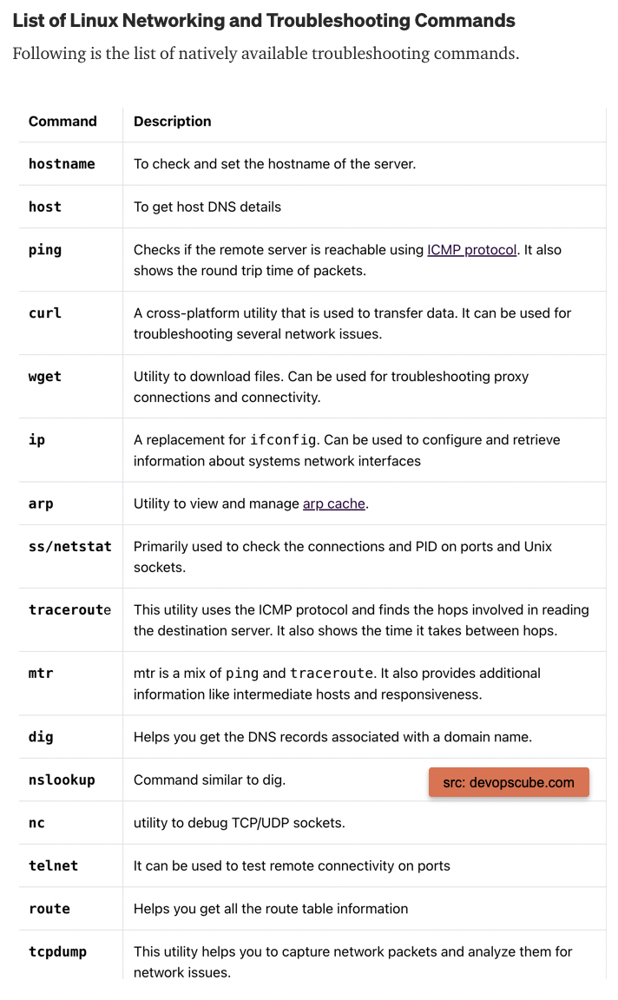

## [What’s the Difference Between a Hub, a Switch, and a Router?](https://medium.com/tech-ramblings/whats-the-difference-between-a-hub-a-switch-and-a-router-53ef5e72316e)
Hubs, switches, and routers are all devices that let you connect one or more computers to other computers, networked devices, or even other networks. Each has two or more connectors called ports, into which you plug the cables to make the connection.

## [List of 16 Linux Networking and Troubleshooting Commands for Beginners](https://devopslearners.com/list-of-16-linux-networking-and-troubleshooting-commands-for-beginners-7692a464f3ca)

