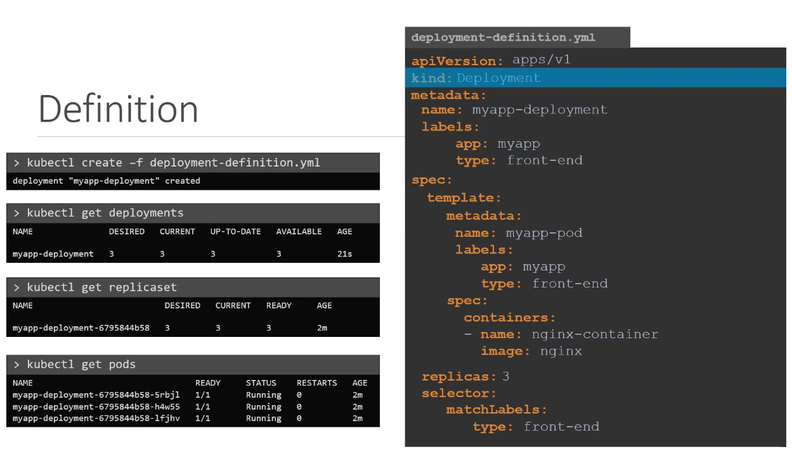
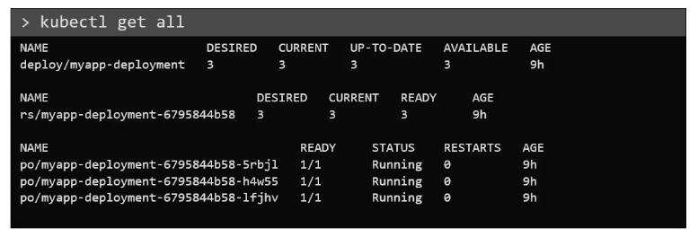
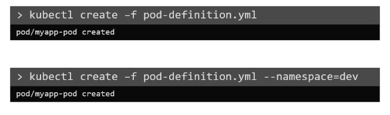
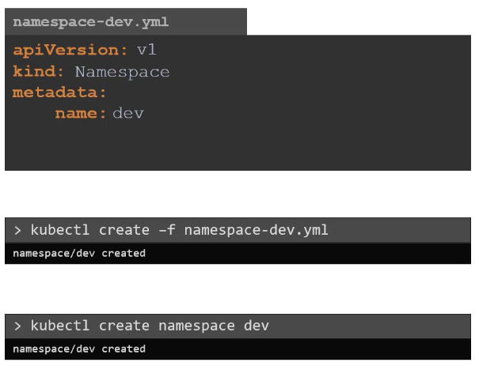
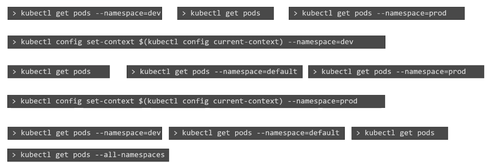
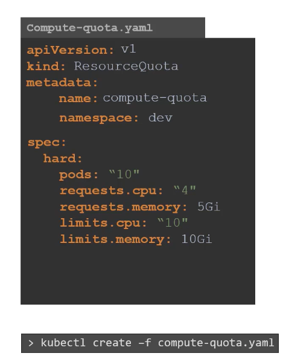
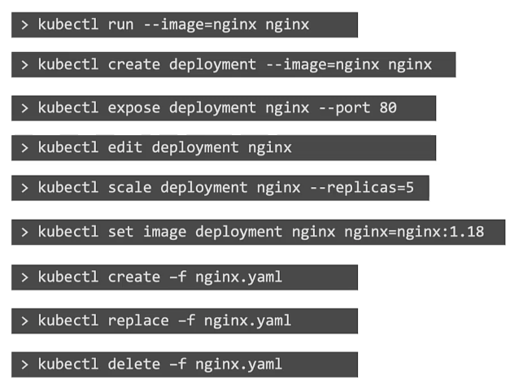
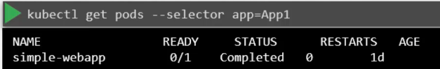

```
$ kubectl describe
You must specify the type of resource to describe. Valid resource types include:
    * all
    * certificatesigningrequests (aka 'csr')
    * clusters (valid only for federation apiservers)
    * clusterrolebindings
    * clusterroles
    * componentstatuses (aka 'cs')
    * configmaps (aka 'cm')
    * daemonsets (aka 'ds')
    * deployments (aka 'deploy')
    * endpoints (aka 'ep')
    * events (aka 'ev')
    * horizontalpodautoscalers (aka 'hpa')
    * ingresses (aka 'ing')
    * jobs
    * limitranges (aka 'limits')
    * namespaces (aka 'ns')
    * networkpolicies
    * nodes (aka 'no')
    * persistentvolumeclaims (aka 'pvc')
    * persistentvolumes (aka 'pv')
    * pods (aka 'po')
    * poddisruptionbudgets (aka 'pdb')
    * podsecuritypolicies (aka 'psp')
    * podtemplates
    * replicasets (aka 'rs')
    * replicationcontrollers (aka 'rc')
    * resourcequotas (aka 'quota')
    * rolebindings
    * roles
    * secrets
    * serviceaccounts (aka 'sa')
    * services (aka 'svc')
    * statefulsets
    * storageclasses
    * thirdpartyresources
```

```
alias k=kubectl
```
```
k get pods -A
k get pods -A -o wide
k get pods -A -o yaml
k get pods -A -o json
```

```
k get pods -A -o json | jq -r ".items[].spec.containers[].name"  #only names
```
```
k explain pod
k explain deployment
```
```
k run firstpod --image=nginx --restart=Never  # create a simple pod
```
```
 k describe pods firstpod
```
```
 k logs firstpod
```
```
k logs -f firstpod
```
```
k exec firstpod -- hostname
```
```
 k exec firstpod -- ls
```
```
k exec firstpod -it firstpod -- /bin/sh
```
```
 k delete pods firstpod
```

```
 k apply -f pod1.yaml
```

```
k run secondpod --image=nginx --port=80 --labels="app=frontend" --restart=Never
```

```
k edit pods firstpod    #pod/firstpod edited
```

```
k apply -f podlife1.yaml
```
```
k get pods -w  # watch live
```

```
k delete -f podlife1.yaml
```

```
 minikube start
```
```
minikube delete
```
```

```
k apply -f podmulticontainer.yaml
```

k logs -f multicontainer -c sidecarcontainer
```

```
k exec -it multicontainer -c webcontainer -- /bin/sh
```
```
 k exec -it multicontainer -c sidecarcontainer -- /bin/sh
```
```
k port-forward pod/multicontainer 8080:80
```

```
 k apply -f podinitcontainer.yaml
```

```
k logs -f initcontainerpod -c initcontainer
```

```
 k get namespaces
```

```
k get pods --namespace kube-system
```
```
k get pods --all-namespaces
```
```
╰─ k get pods --all-namespaces -A
```
```
 k create namespace app1
```

```
 k get namespaces
```

```
─ k apply -f podnamespace.yaml
```

```
k get pods -n development
```

```
─ k exec -it namespacepod -n development -- /bin/sh
```
```
k config set-context --current --namespace=development
```
```
 k get pods
```
```
k config set-context --current --namespace=default
```
```
k create deployment firstdeployment --image=nginx:latest --replica=2
```
```
kubectl delete --all pods
```

```
k get pods
```

```
 watch kubectl get pods
```
```
k set image deployment/seconddeployment nginx=httpd
```

```
k scale deploy seconddeployment --replicas=5
```

```
k apply -f deploymenttemplate.yaml
```

```
k set image deployment/firstdeployment nginx=httpd
```

```
k rollout undo deploy firstdeployment
```

```
k apply -f podlabel.yaml
```

```
k get pods -o wide
```

```
k get pods -l "app" --show-labels
```

```
k get pods -l "app=firstapp" --show-labels
```

```
k get pods -l "app=firstapp, tier=frontend" --show-labels
```
```
k get pods -l "app=firstapp, tier!=frontend" --show-labels
```

```
 k get pods -l "app,tier=frontend" --show-labels
```

```
k get pods -l 'app in (firstapp)' --show-labels
```

```
k get pods -l 'app in (firstapp, secondapp)' --show-labels
```

```
k get pods -l 'app notin (firstapp)' --show-labels
```
```
k get pods -l '!app' --show-labels
```

```
k get pods -l 'app in (firstapp), tier notin (frontend)' --show-labels
```

```
k label pods pod9 app=thirdapp
```

```
k label pods pod9 app-
```

```
k label --overwrite pods pod9 team=team3   # update
```

```
k label pods --all foo=bar  # give same label to all pods
```

```
k get nodes --show-labels
```

```
k label nodes minikube hddtype=ssd
```

```
k get pods -w
```

```
k run nginx --image=nginx
```

```
kubectl describe pod podname | grep -i image
```

```
k run redis --image=redis123 --dry-run=client -o yaml > pod.yaml  #run a new pod
```

```
k apply -f pod.yaml
```
```
k edit pod redis
```
```
k edit replicaset new-replica-set
```
```
kubectl scale rs new-replica-set --replicas=5
```




Create an NGINX Pod
```
kubectl run nginx --image=nginx
```
Generate POD Manifest YAML file (-o yaml). Don’t create it(–dry-run)
```
kubectl run nginx --image=nginx --dry-run=client -o yaml
```

Create a deployment
```
kubectl create deployment --image=nginx nginx
```
Generate Deployment YAML file (-o yaml). Don’t create it(–dry-run)
```
kubectl create deployment --image=nginx nginx --dry-run=client -o yaml
```
Generate Deployment YAML file (-o yaml). Don’t create it(–dry-run) with 4 Replicas (–replicas=4)
```
kubectl create deployment --image=nginx nginx --dry-run=client -o yaml > nginx-deployment.yaml
```
Save it to a file, make necessary changes to the file (for example, adding more replicas) and then create the deployment.
```
kubectl create -f nginx-deployment.yaml
```
OR

In k8s version 1.19+, we can specify the –replicas option to create a deployment with 4 replicas.
```
kubectl create deployment --image=nginx nginx --replicas=4 --dry-run=client -o yaml > nginx-deployment.yaml
```





## Creating Secret
```
$ echo -n 'admin' > ./username.txt

$ echo -n '123456' > ./password.txt

$ kubectl create secret generic db-user-pass --from-file=./username.txt --from-file=./password.txt

$ kubectl create secret generic db-user-pass --from-file=username=./username.txt --from-file=password=./password.txt

$ kubectl get secrets

$ kubectl describe secrets/db-user-pass

```
## Creating a Secret manually
```
echo -n 'admin' | base64
echo -n '1f2d1e2e67df' | base64
```
```
apiVersion: v1
kind: Secret
metadata:
  name: mysecret
type: Opaque
data:
  username: YWRtaW4=
  password: MWYyZDFlMmU2N2Rm
```

```
kubectl apply -f ./secret.yaml # create
kubectl get secret mysecret -o yaml  # decode
```

```
echo 'MWYyZDFlMmU2N2Rm' | base64 --decode
```

```
k create secret generic mysecret2 --from-literal=db_server=db.example.com --from-literal=db_username=admin --from-literal=db_password=P@assw0rd
```

```
k get secrets
```
```
k create secret generic mysecret3 --from-file=db_server=server.txt --from-file=db_username=username.txt --from-file=db_password=password.txt
```

```
k exec secretpodenv -- printenv
```

```
k create configmap myconfigmap --from-literal=background=blue --from-file=a.txt
```

```
k get pod webapp-color -o yaml > pod.yaml
```

```
k explain pods --recursive | grep envFrom -A3
```

```
k explain pods --recursive | less
```

## secrets and configmap

```
kubectl create secret generic db-user-pass --from-file=./username.txt --from-file=./password.txt
```
```
kubectl create secret generic db-user-pass-key --from-file=username=./username.txt --from-file=password=./password.txt
```
```
echo -n 'admin' | base64
echo -n '1f2d1e2e67df' | base64
```
```
echo 'MWYyZDFlMmU2N2Rm' | base64 --decode
```

```
kubectl create configmap demo-config --from-file=./config
```



