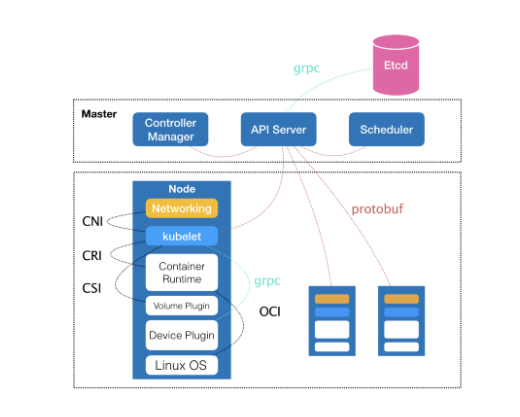

- A `container runtime` is software that executes containers and manages container images on a node. [***](https://kubernetes.io/blog/2018/05/24/kubernetes-containerd-integration-goes-ga/)

- "Does switching to containerd mean I can't use Docker Engine anymore?" We hear this question a lot, the short answer is NO. (Since containerd is being used by both Kubelet and Docker Engine, this means users who choose the containerd integration will not just get new Kubernetes features, performance, and stability improvements, they will also have the option of keeping Docker Engine around for other use cases.)

`Kubernetes is removing support for Docker as a container runtime.` Kubernetes does not actually handle the process of running containers on a machine. Instead, it relies on another piece of software called a container runtime.[***](https://acloudguru.com/blog/engineering/kubernetes-is-deprecating-docker-what-you-need-to-know)

`containerD` An industry-standard container runtime with an emphasis on simplicity, robustness and portability [***](https://containerd.io/)

`kubeadm` is a tool built to provide kubeadm init and kubeadm join as best-practice "fast paths" for creating Kubernetes clusters.[***](https://kubernetes.io/docs/reference/setup-tools/kubeadm/)

`kubectl` controls the Kubernetes cluster manager [***](https://kubernetes.io/docs/reference/kubectl/kubectl/)

The `kubelet` is the primary "node agent" that runs on each node. It can register the node with the apiserver using one of: the hostname; a flag to override the hostname; or specific logic for a cloud provider.[***](https://kubernetes.io/docs/reference/command-line-tools-reference/kubelet/)

## Master node

The master is composed of three closely coordinated independent components:
- `kube-apiserver`: Responsible for API services
- `kube-scheduler`: Responsible for scheduling
- `kube-controller`-manager: Responsible for container orchestration

The persistent data of the entire cluster is processed by kube-apiserver and stored in Etcd .

## Compute node

The core part of the computing node is a component called
`kubelet`. It has the following three core functions:
- `kubelet` is mainly responsible for dealing with the container runtime (such as the Docker project). What this interaction relies on is a remote calling interface called CRI (Container Runtime Interface) . CRI defines the core operations of the container runtime, such as all the parameters required to start a container. As long as your container can run standard container images at runtime, it can be connected to the Kubernetes project by implementing CRI.

- `kubelet` also interacts with a plug-in called Device Plugin through the gRPC protocol. This plug-in is the main component used by k8s project to manage the physical devices of the host such as GPU. It is also a function that must be paid attention to for machine learning training and high-performance operation support based on the k8s project

- `kubelet` also make calls to the network plug-in and storage plug-in to configure the network and persistent storage for the container, through two interfaces: CNI (Container Networking Interface) and CSI (Container Storage Interface)[***](https://aws.plainenglish.io/kubernetes-deep-dive-one-k8s-basics-81e59d81f4bd)