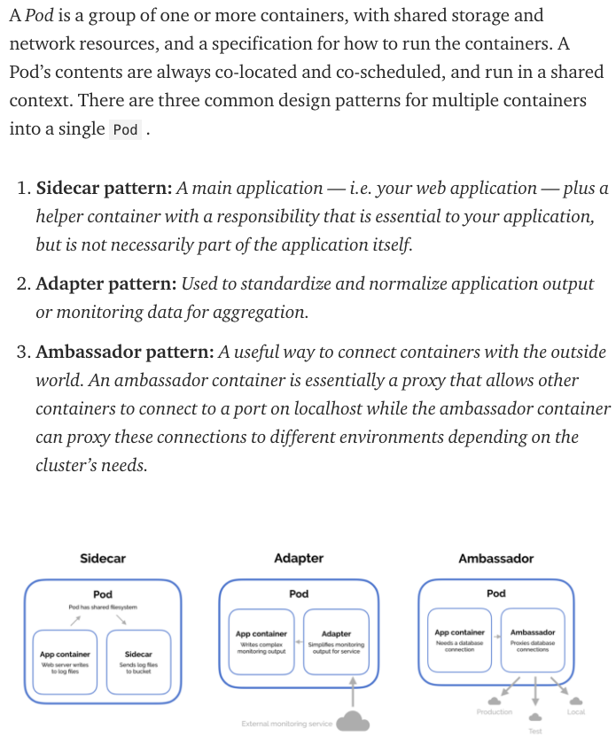

[Install Kubernetes from Scratch](https://www.youtube.com/watch?v=uUupRagM7m0&list=PL2We04F3Y_41jYdadX55fdJplDvgNGENo)

All the instructions required to deploy this cluster is recorded in the github repository here.

 https://github.com/mmumshad/kubernetes-the-hard-way
Credits: https://github.com/kelseyhightower/kubernetes-the-hard-way

`!!!`(click => `***` for info and references)
- A `container runtime` is software that executes containers and manages container images on a node. [***](https://kubernetes.io/blog/2018/05/24/kubernetes-containerd-integration-goes-ga/)

- "Does switching to containerd mean I can't use Docker Engine anymore?" We hear this question a lot, the short answer is NO. (Since containerd is being used by both Kubelet and Docker Engine, this means users who choose the containerd integration will not just get new Kubernetes features, performance, and stability improvements, they will also have the option of keeping Docker Engine around for other use cases.)

`Kubernetes is removing support for Docker as a container runtime.` Kubernetes does not actually handle the process of running containers on a machine. Instead, it relies on another piece of software called a container runtime.[***](https://acloudguru.com/blog/engineering/kubernetes-is-deprecating-docker-what-you-need-to-know)

`containerD` An industry-standard container runtime with an emphasis on simplicity, robustness and portability [***](https://containerd.io/)

`kubeadm` is a tool built to provide kubeadm init and kubeadm join as best-practice "fast paths" for creating Kubernetes clusters.[***](https://kubernetes.io/docs/reference/setup-tools/kubeadm/)

`kubectl` controls the Kubernetes cluster manager [***](https://kubernetes.io/docs/reference/kubectl/kubectl/)

The `kubelet` is the primary "node agent" that runs on each node. It can register the node with the apiserver using one of: the hostname; a flag to override the hostname; or specific logic for a cloud provider.[***](https://kubernetes.io/docs/reference/command-line-tools-reference/kubelet/)


## Master node

The master is composed of three closely coordinated independent components:
- `kube-apiserver`: Responsible for API services
- `kube-scheduler`: Responsible for scheduling
- `kube-controller`-manager: Responsible for container orchestration

The persistent data of the entire cluster is processed by kube-apiserver and stored in Etcd .

## Compute node

The core part of the computing node is a component called
`kubelet`. It has the following three core functions:
- `kubelet` is mainly responsible for dealing with the container runtime (such as the Docker project). What this interaction relies on is a remote calling interface called CRI (Container Runtime Interface) . CRI defines the core operations of the container runtime, such as all the parameters required to start a container. As long as your container can run standard container images at runtime, it can be connected to the Kubernetes project by implementing CRI.

- `kubelet` also interacts with a plug-in called Device Plugin through the gRPC protocol. This plug-in is the main component used by k8s project to manage the physical devices of the host such as GPU. It is also a function that must be paid attention to for machine learning training and high-performance operation support based on the k8s project

- `kubelet` also make calls to the network plug-in and storage plug-in to configure the network and persistent storage for the container, through two interfaces: CNI (Container Networking Interface) and CSI (Container Storage Interface)[***](https://aws.plainenglish.io/kubernetes-deep-dive-one-k8s-basics-81e59d81f4bd)

```
apiVersion: apps/v1
kind: Deployment
metadata:
  name: nginx-deployment

spec:
  replicas: 2
  selector:
    matchLabels:
      app: nginx
  template:
    metadata:
      labels:
        app: nginx
    spec:
      containers:
      - name: nginx
        image: nginx:1.14.2
        ports:
        - containerPort: 80
```

- `kind`
kind specifies the type of this API object (Type), which is a Deployment in my example.
- `Deployment`
It is an object that defines multiple replica applications (ie multiple replica Pods). In addition, Deployment is also responsible for rolling update of each copy when the Pod definition changes. In my example, we set replicas to 2 .
- `Metadata`
This field is the “identification” of the API object, and it is also the main basis for us to find this object from Kubernetes. The most important field used here is Labels.
- `Labels`
Labels is a set of labels in key-value format. Controller objects like Deployment can filter out the controlled objects it cares about from Kubernetes through this Labels field. In this example, Deployment will identify all running Pods with the tag “app: nginx” as managed objects and ensure that the total number of these Pods is strictly equal to two.
- `Pod`
Pod is the “application” in the k8s world; and an application can be composed of multiple containers.
It should be noted that the method of using one API object (Deployment) to manage another API object (Pod) like this is called the “controller pattern” in k8s. In my example, Deployment plays the role of Pod’s controller.[***](https://aws.plainenglish.io/kubernetes-deep-dive-three-first-container-application-177b4e2b2d02)



So, how is the Pod “created”? The answer is: Pod is actually a set of containers that share certain resources. All containers in a Pod share the same Network Namespace and can declare to share the same Volume.[***](https://aws.plainenglish.io/kubernetes-deep-dive-four-why-we-need-pod-e88949eb7b08)

## Certification Tips – Imperative Commands with Kubectl
While you would be working mostly the declarative way – using definition files, imperative commands can help in getting one time tasks done quickly, as well as generate a definition template easily. This would help save considerable amount of time during your exams.

Before we begin, familiarize with the two options that can come in handy while working with the below commands:

`--dry-run:` By default as soon as the command is run, the resource will be created. If you simply want to test your command , use the `--dry-run=client` option. This will not create the resource, instead, tell you whether the resource can be created and if your command is right.

`-o yaml:` This will output the resource definition in YAML format on screen.


Use the above two in combination to generate a resource definition file quickly, that you can then modify and create resources as required, instead of creating the files from scratch.


### POD
Create an NGINX Pod
```
kubectl run nginx --image=nginx
```


### Generate POD Manifest YAML file (-o yaml). Don’t create it(–dry-run)
```
kubectl run nginx --image=nginx --dry-run=client -o yaml
```


### Deployment
Create a deployment
```
kubectl create deployment --image=nginx nginx
```


### Generate Deployment YAML file (-o yaml). Don’t create it(–dry-run)
```
kubectl create deployment --image=nginx nginx --dry-run=client -o yaml
```


### Generate Deployment with 4 Replicas
```
kubectl create deployment nginx --image=nginx --replicas=4
```


You can also scale a deployment using the `kubectl scale` command.
```
kubectl scale deployment nginx --replicas=4
```

### Another way to do this is to save the YAML definition to a file and modify

```
kubectl create deployment nginx --image=nginx --dry-run=client -o yaml > nginx-deployment.yaml
```


You can then update the YAML file with the replicas or any other field before creating the deployment.


### Service
Create a Service named redis-service of type ClusterIP to expose pod redis on port 6379
```
kubectl expose pod redis --port=6379 --name redis-service --dry-run=client -o yaml
```

(This will automatically use the pod’s labels as selectors)

Or
```
kubectl create service clusterip redis --tcp=6379:6379 --dry-run=client -o yaml
```
(This will not use the pods labels as selectors, instead it will assume selectors as app=redis. You cannot pass in selectors as an option. So it does not work very well if your pod has a different label set. So generate the file and modify the selectors before creating the service)


### Create a Service named nginx of type NodePort to expose pod nginx’s port 80 on port 30080 on the nodes:
```
kubectl expose pod nginx --type=NodePort --port=80 --name=nginx-service --dry-run=client -o yaml
```
(This will automatically use the pod’s labels as selectors, but you cannot specify the node port. You have to generate a definition file and then add the node port in manually before creating the service with the pod.)

Or
```
kubectl create service nodeport nginx --tcp=80:80 --node-port=30080 --dry-run=client -o yaml
```
(This will not use the pods labels as selectors)

Both the above commands have their own challenges. While one of it cannot accept a selector the other cannot accept a node port. I would recommend going with the `kubectl expose` command. If you need to specify a node port, generate a definition file using the same command and manually input the nodeport before creating the service.

Reference:
https://kubernetes.io/docs/reference/generated/kubectl/kubectl-commands

https://kubernetes.io/docs/reference/kubectl/conventions/